<p align="center"></p>

<h1 align="center">Hi, I'm WFxRayZ.😒 </h1> 

<p align="center">
  
</p>

🍕 I'm currently studying Bachelor of Computer Science in Cybersecurity(Hons.).

🍕 I'm a student who are enthusiastic about pursuing Computer Science with a specialization in Cybersecurity.

🍕 I'm passionate about offensive security and the art of deconstruction. 

🍕 I believe the best way to secure a system is to understand exactly how it breaks. \

<p align="center">
  
</p>

```python
class Mission:
    def __init__(self):
        self.focus = ["Ethical Hacking", "System Architecture"]
        self.goal = "Build Stronger Digital Defenses"
        
    def execute(self):
        return "Breaking to fix."
```
<p align="center">
  
</p>

<div align="center">
    <a href="https://www.youtube.com/watch?v=XLGDrx1aYhI">  </a>
</div>
